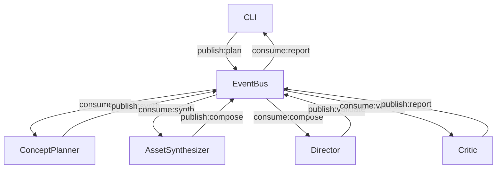

# Motiva Compose CLI

TypeScript製・イベント駆動型のマルチエージェントLLMパイプラインCLI  
**EventBus + EventDrivenOrchestrator + LLM Provider抽象化 + 二軸コスト管理**

---

## 🚩 実装状況まとめ（2025-07-03時点）

- イベント駆動Orchestrator（EventBus + EventDrivenOrchestrator）
- LLM Provider抽象化レイヤ（OpenAI, Anthropic, Groq, Self-hosted Mistral等を即時切替）
- 二軸コスト管理（dual-budget-manager：トークン＋wallTime秒）
- 柔軟なパイプライン定義・キャッシュ・プログレス・通知・レポート
- 各エージェントはイベント購読/発行で疎結合に連携

---

## 1. クイックスタート

```bash
motiva-compose init my-project
cd my-project
echo '恋愛ドラマのオープニングを作って' | motiva-compose orchestrate --pipeline-file pipeline.json
```

---

## 2. パイプライン定義例

```json
{
  "name": "basic-pipeline",
  "agents": [
    {
      "name": "concept-planner",
      "provider": "openai",
      "model": "gpt-4o-mini"
    },
    {
      "name": "asset-synthesizer",
      "provider": "openai",
      "model": "gpt-4o-mini"
    },
    {
      "name": "director",
      "provider": "openai",
      "model": "gpt-4o-mini"
    }
  ],
  "maxConcurrency": 3
}
```

---

## 3. 設定ファイル例（motiva.config.ts）

```ts
import { defineConfig } from 'motiva-compose';

export default defineConfig({
  providers: {
    openai: { apiKey: process.env.OPENAI_API_KEY },
    anthropic: { apiKey: process.env.ANTHROPIC_API_KEY }
  },
  defaultProvider: 'openai',
  maxConcurrency: 3,
  budget: {
    minimal: { monthly: 3, tokens: 100000, wallTimeSec: 7200 }
  }
});
```

---

## 4. コスト管理

- `dual-budget.json`でトークン＋wallTime秒を同時制限
- 並列時も安全弁でコスト爆発を防止
- 80%で警告、95%でAPI呼び出し停止

---

## 5. アーキテクチャ図



---

## 6. 拡張性

- 新エージェント・新Providerはイベント購読/発行で即時追加可能
- LLM Providerは設定ファイルで切替
- コスト管理・キャッシュ・通知も疎結合

---

## 7. 主要コマンド

| コマンド | 概要 |
|----------|------|
| `init` | プロジェクト初期化 |
| `orchestrate` | パイプライン定義ファイルでイベント駆動実行 |
| `validate` | JSONスキーマ検証 |
| `status` | 予算・コスト状況表示 |
| `cache` | キャッシュ管理 |
| `notify` | 通知管理 |
| `report` | レポート管理 |

---

## 8. 今後の拡張

- CRDT Scene Store
- Plugin Sandbox
- APIサーバー
- 詳細なメトリクス・監視

---

MIT License

---

*このプロジェクトは Motiva プロジェクトの一部として、Cursor IDE と連携して開発されています。* 