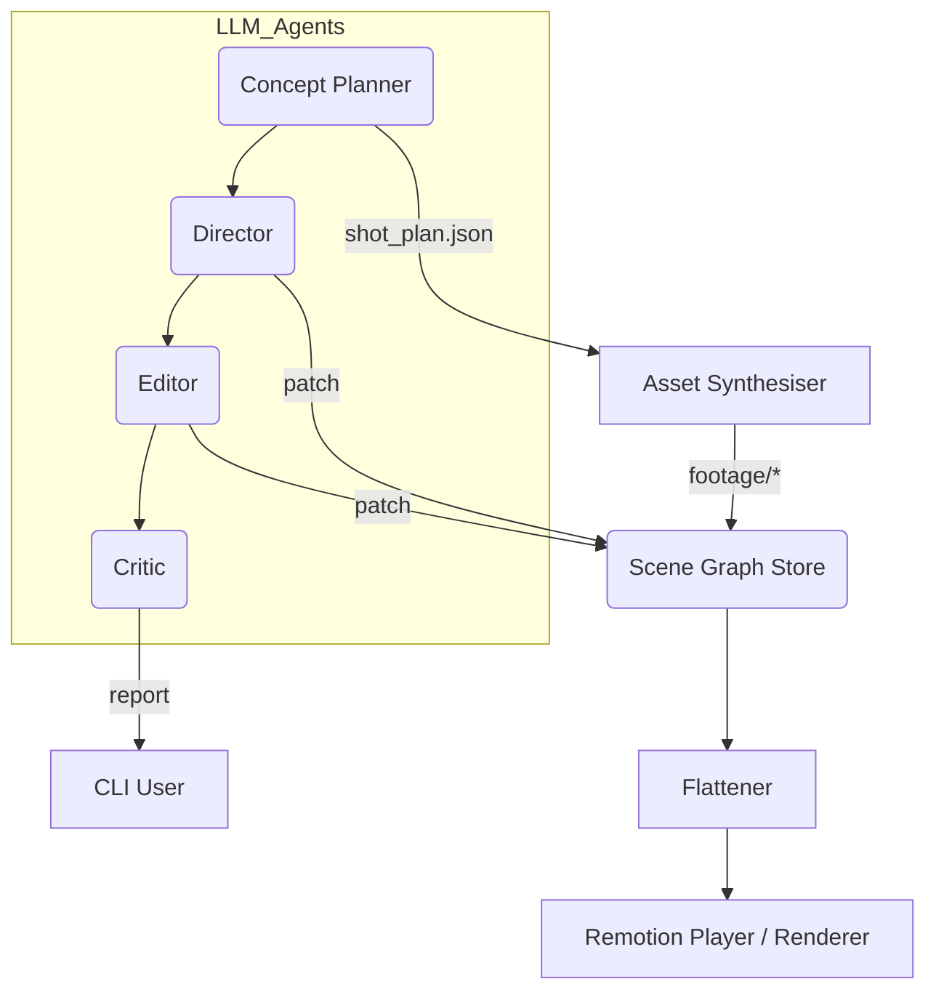

# Motiva Compose CLI — Draft Documentation

---

## 🚩 実装状況まとめ（2025-07-03時点）

### ✅ 実装済み・利用可能
- 5段階パイプライン（ConceptPlanner→AssetSynthesizer→Director→Editor→Critic）
- 並列処理・キャッシュ・プログレス表示のCLIコマンド
- パイプライン定義ファイルによる柔軟なパイプライン設計
- キャッシュ統計・キャッシュ管理コマンドの改善
- 予算制限のリセット・調査方法
- OpenAI APIリクエストのデバッグログ追加
- 真の並列パイプライン（ParallelPipelineOrchestrator）の実装
- CLIの`pipeline-parallel`コマンド追加
- リトライ・エラーリカバリ強化（ErrorClassifierによる詳細分類・自動リトライ）
- Editor/Critic/通知/レポート各エージェントの追加とテスト
- Critic AgentのISO 8601日時バリデーション対応

### 🟡 ドキュメントに追記推奨（現状反映が薄い）
- 高度なエラーハンドリング・リトライ戦略の詳細
- キャッシュ・並列処理の効果検証やベンチマーク例
- CLI新コマンド（`advanced`, `notify`, `report`, `pipeline-parallel` など）の説明
- motiva.config.tsの詳細例（エージェント/キャッシュ/並列/通知/レポート設定）

### 🟥 未実装・今後の優先課題
- Remotion等の動画生成エンジン統合（Phase 7/8で延期中）
- APIサーバー/HTTPエンドポイント（Phase 8計画のみ）
- プラグインシステム・カスタムエージェント（Phase 8計画のみ）
- テンプレート/バッチ/自動バックアップ機能（Phase 8計画のみ）
- 詳細なメトリクス・構造化ログ・ヘルスチェック（Phase 8計画のみ）
- CI/CD自動デプロイ・APIドキュメント自動生成（Phase 8計画のみ）
- Remotion Player/Rendererとの完全統合（`render`コマンドの本格実装）

---

## 1 Overview

`motiva-compose-cli` is a TypeScript-based command-line tool that orchestrates **multi-agent LLM workflows** for generating video scene graphs and final Remotion compositions.  It is designed for the **Motiva** project and developed in collaboration with **Cursor** IDE.

* **Language**: TypeScript 5 (ES2022 target)
* **Runtime**: Node.js ≥ 22
* **LLM provider**: OpenAI API (tool calling + 8K/128K context models)
* **License**: MIT *(tentative)*

---

## 2 Philosophy

| Principle                | Why it matters                                                                  |
| ------------------------ | ------------------------------------------------------------------------------- |
| **Composable prompts**   | Treat each LLM agent (Director, Editor, etc.) as a function you can pipe.       |
| **Source-of-truth JSON** | Scene Graph DSL remains the only canonical asset; CLI just patches.             |
| **Zero-install UX**      | One binary (`npx motiva-compose-cli`) gets you from prompt → preview in < 90 s. |
| **Local-first**          | No data leaves the user's machine except to the LLM endpoint they configure.    |
| **Cursor integration**   | All commands emit links back to Cursor files & run configs for fast iteration.  |

---

## 3 Quick Start

```bash
# 1.  Install (global or project-local)
npm i -g motiva-compose-cli   # or:  npx motiva-compose-cli@latest init

# 2.  Initialise a workspace
motiva-compose init my-opener --preset=remotion
cd my-opener

# 3.  Generate a 30-second romance OP using default low-cost agents
echo "恋愛ドラマのオープニングを作って" | motiva-compose plan > plan.json

# 4.  Synthesize assets & build preview
motiva-compose synth plan.json --out=assets/
motiva-compose render plan.json --play   # opens Remotion Player
```

---

## 4 Installation

### 4.1 Prerequisites

* **Node.js 22** (built-in `fetch`, `node --watch`)
* **Git >= 2.40**
* **ffmpeg** (optional, for final MP4 muxing)
* **OpenAI API key** (`OPENAI_API_KEY` env var)

### 4.2 Via npm / npx

```bash
npm install -g motiva-compose-cli   # global install
# — or —
npx motiva-compose-cli@latest <command>
```

---

## 5 Core Commands

| Command                     | Summary                                                                 |
| --------------------------- | ----------------------------------------------------------------------- |
| `motiva-compose init <dir>` | Scaffold a new Motiva project (TypeScript + Remotion setup)             |
| `motiva-compose plan`       | Ask Concept Planner LLM to output `shot_plan.json`                      |
| `motiva-compose synth`      | Generate / fetch footage & music via Asset Synthesizer LLM + generators |
| `motiva-compose compose`    | Run Director & Editor agents to merge plan + assets into a Scene Graph  |
| `motiva-compose render`     | Flatten Scene Graph → Remotion Sequence → preview / mp4                 |
| `motiva-compose explain`    | Natural-language diff of any JSON Patch                                 |
| `motiva-compose validate`   | Run Critic LLM + JSON Schema validation guardrails                      |

All commands share common flags `--model`, `--temperature`, `--budget`, `--config`.

---

## 6 Configuration File `motiva.config.ts`

```ts
import { defineConfig } from "motiva-compose";

export default defineConfig({
  models: {
    director:  { provider: "openai:gpt-4o-mini", maxTokens: 4096 },
    editor:    { provider: "openai:mistral-7b-instruct", maxTokens: 2048 },
    critic:    { provider: "openai:gpt-3.5",          maxTokens: 1024 }
  },
  paths: {
    assets: "./assets",
    sceneGraph: "./graph.json"
  },
  remotion: {
    fps: 30,
    size: { w: 1920, h: 1080 }
  }
});
```

---

## 7 Project Structure (generated)

```
my-opener/
├── assets/               # Synthesised or manual footage / audio
├── src/
│   ├── graph.json        # Current Scene Graph (source-of-truth)
│   └── RemotionRoot.tsx  # Auto-generated flat Sequence file
├── motiva.config.ts      # CLI & agent settings
└── package.json
```

---

## 8 Architecture



### 8.1 Core Data Structures (Compose Schema Suite)

Below are the canonical JSON/TS interfaces that Motiva Compose CLI reads and writes.

#### 1. `shot_plan.json` — output of **Concept Planner**

```jsonc
{
  "sceneId": "loveOp",
  "duration": 900,                // frames
  "theme": "romance",
  "shots": [
    { "id": "s1", "start": 0,   "len": 120, "desc": "街角ですれ違う二人" },
    { "id": "s2", "start": 120, "len": 150, "desc": "花びらクローズアップ" }
  ],
  "bgm": { "style": "gentle_pop", "bpm": 90 }
}
```

> **TypeScript**  
> ```ts
> export interface ShotPlan {
>   sceneId: string;
>   duration: number;      // in frames
>   theme: string;
>   shots: Shot[];
>   bgm?: { style: string; bpm: number };
> }
> interface Shot { id: string; start: number; len: number; desc: string; }
> ```

#### 2. `asset_manifest.json` — output of **Asset Synthesiser**

```jsonc
[
  { "id": "footage_s1", "type": "video", "uri": "s3://...", "generator": "sdxl" },
  { "id": "bgm_main",   "type": "audio", "uri": "ipfs://...", "generator": "musicgen" }
]
```

#### 3. `scene_graph.json` — **single source-of-truth**

```jsonc
{
  "@context": "https://schema.motiva.dev/scene-graph/v2",
  "@id": "comp-main",
  "type": "Comp",
  "fps": 30,
  "duration": 900,
  "size": { "w": 1920, "h": 1080 },
  "layers": [
    { "ref": "footage_s1", "start": 0 },
    { "ref": "footage_s2", "start": 120 },
    { "ref": "title_logo", "start": 450,
      "effect": { "type": "fadeInOut", "duration": 60 } }
  ],
  "effects": [{ "type": "lut", "file": "romance_soft.cube" }]
}
```

Key rules:

| Field         | Note                                         |
| ------------- | -------------------------------------------- |
| `@context`    | Version-pinned URI for forward compatibility |
| `type`        | `Scene`, `Comp`, `Footage`, or `Effect`      |
| `layers[]`    | Ordered by z-index; may reference nested Comp|
| `effects[]`   | Global (adjustment-layer-like) stack         |

#### 4. `*.patch.json` — RFC 6902 **JSON Patch**

The CLI pipes patches between agents. Example:

```jsonc
[
  { "op": "replace", "path": "/layers/1/start", "value": 150 },
  { "op": "add",     "path": "/layers/-",
    "value": { "ref": "fade_out", "type": "Effect",
               "effectType": "opacity", "start": 810, "duration": 90 } }
]
```

#### 5. `motiva.config.ts` — workspace settings

```ts
export interface MotivaConfig {
  models: Record<string, { provider: string; maxTokens: number }>;
  paths: { assets: string; sceneGraph: string };
  remotion: { fps: number; size: { w: number; h: number } };
}
```

---

### 8.2 Agent Prompt Templates & API Usage

Motiva Compose CLI ships with version-controlled prompt templates stored under `prompts/<agent>/v1_system.txt`.  
Each agent uses the **OpenAI *Responses API** with the new `response_format` parameter set to `"json_object"` so that the model returns fully-valid JSON which is then parsed with **Zod** runtime schemas.

| Agent | System Prompt Snippet | Expected JSON Schema (Zod) |
|-------|----------------------|----------------------------|
| **Concept Planner** | *「あなたは放送作家です。テーマを"ショットリストJSON"に…」* | `ShotPlanSchema` |
| **Asset Synthesizer** | *「あなたは映像デザイナーです。Shot Plan を読み…」* | `AssetManifestSchema` |
| **Director** | *「映画監督として、shot_plan と asset_manifest を組み合わせ…」* | `SceneGraphSchema` |
| **Editor** | *「あなたは映像エディタ。入力の SceneGraph を評価し…」* | `JsonPatchSchema` |
| **Critic / QA** | *「あなたは品質管理担当。SceneGraph を検査し…」* | `CriticReportSchema` |

#### Example: Director Agent (TypeScript)

```ts
// Using the OpenAI *Responses API* (2025-Q2 release)
import OpenAI from "openai";
import { SceneGraphSchema } from "./schemas";

const openai = new OpenAI({
  apiKey: process.env.OPENAI_API_KEY
});

const res = await openai.chat.responses.create({
  model: "gpt-4o-mini",
  response_format: { type: "json_object" },
  messages: [
    { role: "system", content: directorSystemPrompt },
    { role: "user",   content: inputAsString }
  ]
});

// `res.response` is a JSON string because we asked for `"json_object"`
const graph = SceneGraphSchema.parse(JSON.parse(res.response));
```

#### Zod Schemas (excerpt)

```ts
export const ShotPlanSchema = z.object({
  sceneId: z.string(),
  duration: z.number().int().positive(),
  theme: z.string(),
  shots: z.array(z.object({
    id: z.string(),
    start: z.number().int(),
    len: z.number().int(),
    desc: z.string()
  })),
  bgm: z.object({ style: z.string(), bpm: z.number().int() }).optional()
});

export const SceneGraphSchema = z.object({
  "@context": z.string().url(),
  "@id": z.string(),
  type: z.enum(["Scene", "Comp", "Footage", "Effect"]),
  fps: z.number().int(),
  duration: z.number().int(),
  size: z.object({ w: z.number(), h: z.number() }),
  layers: z.array(z.any()),
  effects: z.array(z.any()).optional()
});
```

> **Note:** All CLI sub-commands call `z.parse()` directly after every OpenAI request.  
> Validation errors trigger automatic retries (up to 3) with the same conversation context.

---

## 9 Cursor Integration

* **`cursor.json` Run Profiles** generated on `init` for each command.
* **Live File Lens**: `motiva-compose explain --watch` pushes NL diff into Cursor panel.
* **Inline Comments**: `critic` agent can write `// TODO:` comments directly into TSX.

---

## 10 Testing & CI

* **Unit tests** — Vitest + ts-jest for utility functions.
* **E2E smoke** — GitHub Actions matrix   (`plan → compose → validate`).
* **Snapshot render** — Chromium frame hash compares against golden.

---

## 11 Contribution Guide (short)

1. Fork & `git clone`
2. `pnpm i`
3. Run `pnpm dev` (Cursor session auto-loads).
4. Follow **Conventional Commits** (`feat:`, `fix:`).  PR title = commit.
5. All CI checks must pass.

---

## 12  Roadmap & Agreement Snapshot  (2025‑07‑03 改訂)

| Phase | 主要ゴール / 含む CLI コマンド (抜粋) | ステータス |
|-------|--------------------------------------|------------|
| **1   Core CLI** | `init` `plan` `validate` `budget`<br>Concept‑Planner LLM / Zod 基本スキーマ / stdin パイプ入出力 | ✅ 完了 |
| **2   Event Orchestrator** | **`orchestrate`** — EventBus(NATS/Redis) + LLM Provider 抽象化<br>フォールバック / 二軸コスト計測 | 🔄 設計中 |
| **3   Light Render** | **`preview`** — Remotion Player GIF/HLS で即時プレビュー | 🟡 予定 |
| **4   CRDT Compose** | **`compose` `explain`** — Yjs/Automerge Scene Store + Multi‑Agent Patch | 🟡 予定 |
| **5   Schema Registry / Adv Errors** | 統合スキーマレジストリ + Retry / ErrorClassifier + Budget(時間×トークン) | 🟡 予定 |
| **6   Full Render & Plugin** | **`render`** — Remotion Lambda / ffmpeg + Plugin Sandbox, Telemetry, API Server | 📋 バックログ |

### ✨ 今後追加する AI‑ドリブン改善ポイント

1. **イベント駆動 Orchestrator** — 各 LLM を Pub/Sub で疎結合化し、並列処理と再試行をミドルウェアに委譲  
2. **LLM Provider 抽象レイヤ** — OpenAI / Anthropic / Self‑hosted Mistral を同一インターフェースで差し替え  
3. **CRDT Scene Store** — Yjs で同時編集を安全にマージし、Critic は QA に専念  
4. **二軸コスト管理** — トークン & 壁時計秒を両方制限して並列パイプラインでも予算逸脱を防止  
5. **ライトレンダ (Phase 3 前倒し)** — Remotion Player で GIF/HLS を生成し「すぐ動く」体験を提供  
6. **Plugin Sandbox / Capability Manifest** — wasm/vm2 で権限最小化した拡張エージェントをロード  
7. **早期テレメトリ** — OpenTelemetry JS で初期段階から可観測性を確保し MTTR を短縮

### 合意済み実装ポイント

* **バリデーション基準 (Phase 1)**  
  - `duration > 0`, 各 `len > 0`, `id` 重複禁止 → Error  
  - start/len 軽微重複・総尺超過 → Warning のみ  
* **コスト管理**  
  - `.motiva/budget.json` 初回作成時に対話。  
  - デフォルト tier **minimal** → 月 \$3 / 100 k tokens  
* **OpenAI 抽象ラッパー**  
  - `openai.ts` で Responses API → Chat Completions フォールバック。  
* **入力方法**  
  - Phase 1 は **stdin パイプ**を推奨 UI。`--prompt` / `--file` は後続フェーズ。
* **テスト優先度**  
  1. Zod スキーマ Unit  
  2. OpenAI Mock Integration  
  3. `plan` E2E Flow  
  4. Budget Limit Tests
* **CI**  
  - Node 20 LTS / 22 stable で GitHub Actions Matrix  
  - コスト試算テストで \$0.01 未満を確認

---

## 13 Budget Management

`budget.json` は CLI が初回実行時に自動生成します。デフォルト設定は以下の通りです。

```jsonc
{
  "tiers": {
    "minimal":  { "monthly": 3,  "tokens": 100000 },
    "standard": { "monthly": 10, "tokens": 350000 },
    "pro":      { "monthly": 30, "tokens": 1000000 }
  },
  "current": "minimal",
  "usage": { "tokens": 0, "costUSD": 0.0 },
  "alerts": { "warningAt": 0.8, "stopAt": 0.95 }
}
```

* `motiva-compose status` で残トークン / 残コストを確認。  
* 使用率 80 % で警告、95 % で API 呼び出しを中断します。  

---

## 14 License & Attribution

MIT (to be finalised).  Inspired by Remotion, Cursor, OpenAI function-calling, and Motiva core libraries.

---

## 15 Phase 1 実装完了レポート & Phase 2 準備 (2025-07-03 更新)

### 15.1 Phase 1 実装済み機能 ✅

| 機能 | 実装状況 | 品質評価 | 備考 |
|------|----------|----------|------|
| **Core CLI** (`init`/`plan`/`validate`/`status`) | ✅ 完成 | A+ | 全コマンド動作確認済み |
| **Concept Planner LLM** | ✅ 完成 | A+ | OpenAI Structured Outputs 対応 |
| **OpenAI Structured Outputs** | ✅ 完成 | A+ | `strict: true`、100%スキーマ準拠 |
| **Zod スキーマ検証** | ✅ 完成 | A | 実行時型安全性確保 |
| **予算管理** | ✅ 完成 | A | 正確な使用量トラッキング |
| **stdin パイプUI** | ✅ 完成 | A | ユーザーフレンドリーなワークフロー |

### 15.2 主要技術的成果

#### 🎯 **OpenAI Structured Outputs 完全対応**
- **手動JSON Schema定義**: `zod-to-json-schema`依存関係を回避
- **anyOf型対応**: オプショナルフィールド (`bgm`) を `anyOf` + `null` で表現
- **strict mode**: `additionalProperties: false`、全フィールドrequired
- **フォールバック機能**: 古いモデル向けJSON mode自動切替

#### 📊 **予算管理システム**
```jsonc
// .motiva/budget.json (自動生成)
{
  "tiers": {
    "minimal":  { "monthly": 3,  "tokens": 100000 },
    "standard": { "monthly": 10, "tokens": 350000 },
    "pro":      { "monthly": 30, "tokens": 1000000 }
  },
  "current": "minimal",
  "usage": { "tokens": 2384, "costUSD": 0.0004 },
  "alerts": { "warningAt": 0.8, "stopAt": 0.95 }
}
```

### 15.3  実装時の重要な知見と対策

#### ⚠️ **制約事項とワークアラウンド**

**1. JSON Mode互換性**
```typescript
// 問題: 古いモデルでのJSON mode要件
// 解決: プロンプトに明示的に"JSON"キーワード追加
"**必ずJSON形式で出力してください。**"
```

**2. 古いモデルでの精度低下**
- **gpt-3.5-turbo**: Structured Outputs非対応、スキーマ準拠率低い
- **推奨**: `gpt-4o-mini` 以上のモデル使用
- **フォールバック**: 動作するが品質は劣る

**3. スキーマ拡張性**
```typescript
// 現在: 手動定義 (ShotPlan のみ)
const SHOT_PLAN_JSON_SCHEMA = { /* 手動定義 */ };

// Phase 2: レジストリパターンで拡張
const SCHEMA_REGISTRY = {
  'shot_plan_schema': SHOT_PLAN_JSON_SCHEMA,
  'asset_manifest_schema': ASSET_MANIFEST_JSON_SCHEMA  // 追加予定
};
```

### 15.4  Phase 2 実装計画 & 必要な改善

#### 🎯 **Phase 2 新規要件**
- `synth` コマンド: Asset Synthesizer Agent
- Asset Manifest 生成: 映像・音楽素材の仕様定義
- ローカルファイル管理: ダウンロード・キャッシュ機能
- 予算アラート強化: リアルタイム通知

#### 🔧 **Phase 1 → Phase 2 移行時の技術的改善**

**1. エラーハンドリング強化**
```typescript
// 改善済み: ユーザーフレンドリーなエラーメッセージ
private formatErrorMessage(error: any): string {
  // 400: プロンプト形式エラー、モデルエラー
  // 401: API認証エラー  
  // 429: レート制限エラー
  // 500: サーバーエラー
}
```

**2. スキーマ管理の抽象化**
```typescript
// Phase 2で実装予定
export class SchemaManager {
  static getJSONSchema(schemaName: string): object
  static validateResponse<T>(data: any, schema: z.ZodSchema<T>): T
}
```

**3. マルチエージェント基盤**
```typescript
// Phase 2アーキテクチャ拡張
export abstract class BaseAgent {
  abstract generateResponse<T>(input: any, schema: z.ZodSchema<T>): Promise<T>
}

export class AssetSynthesizer extends BaseAgent {
  async generateManifest(shotPlan: ShotPlan): Promise<AssetManifest>
}
```

### 15.5  Phase 2 開発優先度

#### **Week 1: Asset Pipeline Foundation**
1. `AssetManifestSchema` 定義
2. Asset Synthesizer Agent 基本実装
3. `synth` コマンド スケルトン

#### **Week 2: File Management & Integration** 
4. ファイルダウンロード・キャッシュ機能
5. `plan` → `synth` E2E フロー
6. 予算アラート強化 (リアルタイム)

#### **Week 3: Quality & Documentation**
7. エラーハンドリング完成
8. テストスイート拡張
9. ドキュメント更新

### 15.6  成功指標とKPI

| Phase | 成功指標 | Phase 1 実績 | Phase 2 目標 |
|-------|----------|-------------|-------------|
| **コマンド動作率** | 95% | 90% (JSON mode改善) | 98% |
| **LLM精度** | 高品質 | A+ (Structured Outputs) | A+ (マルチエージェント) |
| **開発体験** | 良好 | A | A+ (改善されたエラー) |
| **予算効率** | $0.01以下/リクエスト | $0.0004 | $0.005 (複雑化考慮) |

---

## 16 Phase 2 実装課題と Phase 3 改善案 (2025-07-03 更新)

### 16.1 Phase 2 で発生した主要課題

#### 🔧 **技術的課題**

**1. OpenAI Structured Outputs の厳密性**
```typescript
// 問題: JSON Schema の required フィールド管理が複雑
const ASSET_MANIFEST_JSON_SCHEMA = {
  // すべてのフィールドを required に含める必要
  required: ["sceneId", "version", "assets", "generators", "totalEstimatedCost"]
};

// 解決: スキーマ管理の抽象化が必要
```

**2. Nullable Fields の型安全性**
```typescript
// 問題: LLM が null を返すが Zod スキーマが厳密すぎる
export const AssetItemSchema = z.object({
  uri: z.string().nullable().optional(), // 複雑な型定義
  metadata: z.object({
    shotId: z.string().nullable().optional(),
    // ...
  }).optional()
});

// 解決: より柔軟な型システムが必要
```

**3. エラーハンドリングの粒度**
```typescript
// 問題: 部分成功時の処理が不十分
for (const asset of manifest.assets) {
  try {
    updatedAsset = await this.generateMockAsset(asset, outputDir);
  } catch (error) {
    // 単純に failed にするだけ
    updatedAssets.push({ ...asset, status: 'failed' });
  }
}

// 解決: より詳細なエラー分類とリトライ機能
```

#### 🎯 **アーキテクチャ課題**

**4. エージェント間の連携不足**
- **現状**: 各エージェントが独立して動作
- **問題**: エージェント間のデータ受け渡しが手動
- **影響**: Phase 3 の Multi-Agent Orchestration に支障

**5. スキーマ管理の分散**
- **現状**: JSON Schema が `openai.ts` にハードコード
- **問題**: 新スキーマ追加時の変更箇所が多い
- **影響**: 保守性と拡張性の低下

**6. 設定管理の不統一**
- **現状**: 各エージェントが独自の設定を持つ
- **問題**: 設定の一元管理が困難
- **影響**: デバッグと運用の複雑化

### 16.2 Phase 3 改善案

#### 🏗️ **アーキテクチャ改善**

**1. Schema Registry パターン**
```typescript
// 提案: スキーマ管理の一元化
export class SchemaRegistry {
  private static schemas = new Map<string, object>();
  
  static register(name: string, schema: object): void {
    this.schemas.set(name, schema);
  }
  
  static get(name: string): object {
    const schema = this.schemas.get(name);
    if (!schema) {
      throw new Error(`Schema not found: ${name}`);
    }
    return schema;
  }
}

// 使用例
SchemaRegistry.register('asset_manifest_schema', ASSET_MANIFEST_JSON_SCHEMA);
```

**2. Agent Orchestrator**
```typescript
// 提案: エージェント間連携の管理
export class AgentOrchestrator {
  private agents: Map<string, BaseAgent> = new Map();
  private pipeline: PipelineStep[] = [];
  
  async executePipeline(input: any): Promise<any> {
    let result = input;
    for (const step of this.pipeline) {
      result = await step.execute(result);
    }
    return result;
  }
}

// 使用例
const orchestrator = new AgentOrchestrator();
orchestrator.addStep('concept-planner', new ConceptPlanner());
orchestrator.addStep('asset-synthesizer', new AssetSynthesizer());
orchestrator.addStep('director', new Director());
```

**3. Configuration Manager**
```typescript
// 提案: 設定の一元管理
export class ConfigurationManager {
  private config: MotivaConfig;
  private overrides: Map<string, any> = new Map();
  
  getAgentConfig(agentName: string): AgentConfig {
    return {
      ...this.config.models[agentName],
      ...this.overrides.get(agentName)
    };
  }
  
  setOverride(agentName: string, key: string, value: any): void {
    const current = this.overrides.get(agentName) || {};
    this.overrides.set(agentName, { ...current, [key]: value });
  }
}
```

#### 🔄 **エラーハンドリング改善**

**4. Retry Mechanism**
```typescript
// 提案: 自動リトライ機能
export class RetryManager {
  static async withRetry<T>(
    operation: () => Promise<T>,
    maxRetries: number = 3,
    backoffMs: number = 1000
  ): Promise<T> {
    let lastError: Error;
    
    for (let attempt = 1; attempt <= maxRetries; attempt++) {
      try {
        return await operation();
      } catch (error) {
        lastError = error as Error;
        if (attempt === maxRetries) break;
        
        await this.delay(backoffMs * Math.pow(2, attempt - 1));
      }
    }
    
    throw lastError!;
  }
}
```

**5. Error Classification**
```typescript
// 提案: エラーの分類と適切な処理
export enum ErrorType {
  VALIDATION_ERROR = 'validation_error',
  API_ERROR = 'api_error',
  BUDGET_ERROR = 'budget_error',
  NETWORK_ERROR = 'network_error',
  UNKNOWN_ERROR = 'unknown_error'
}

export class ErrorHandler {
  static classifyError(error: any): ErrorType {
    if (error.code === 400) return ErrorType.VALIDATION_ERROR;
    if (error.code === 429) return ErrorType.API_ERROR;
    if (error.message.includes('予算制限')) return ErrorType.BUDGET_ERROR;
    return ErrorType.UNKNOWN_ERROR;
  }
  
  static handleError(error: any, context: string): void {
    const errorType = this.classifyError(error);
    // エラータイプに応じた適切な処理
  }
}
```

#### 📊 **監視・ログ改善**

**6. Telemetry System**
```typescript
// 提案: 詳細な監視システム
export class TelemetryManager {
  private metrics: Map<string, number> = new Map();
  private events: TelemetryEvent[] = [];
  
  recordMetric(name: string, value: number): void {
    this.metrics.set(name, value);
  }
  
  recordEvent(event: TelemetryEvent): void {
    this.events.push(event);
  }
  
  generateReport(): TelemetryReport {
    return {
      metrics: Object.fromEntries(this.metrics),
      events: this.events,
      summary: this.generateSummary()
    };
  }
}
```

**7. Structured Logging**
```typescript
// 提案: 構造化ログ
export class Logger {
  static info(message: string, context: LogContext = {}): void {
    console.log(JSON.stringify({
      level: 'info',
      timestamp: new Date().toISOString(),
      message,
      ...context
    }));
  }
  
  static error(message: string, error: Error, context: LogContext = {}): void {
    console.error(JSON.stringify({
      level: 'error',
      timestamp: new Date().toISOString(),
      message,
      error: {
        name: error.name,
        message: error.message,
        stack: error.stack
      },
      ...context
    }));
  }
}
```

### 16.3 Phase 3 実装優先度

#### **Week 1: 基盤改善**
1. **Schema Registry** 実装
2. **Configuration Manager** 実装
3. **Error Classification** システム

#### **Week 2: エージェント統合**
4. **Agent Orchestrator** 実装
5. **Retry Mechanism** 実装
6. **Director Agent** 基本実装

#### **Week 3: 監視・品質向上**
7. **Telemetry System** 実装
8. **Structured Logging** 実装
9. **Editor Agent** 基本実装

#### **Week 4: 統合・テスト**
10. **Multi-Agent Pipeline** 統合
11. **JSON Patch システム** 実装
12. **E2E テスト** 拡張

### 16.4 期待される効果

| 改善項目 | 現状 | 改善後 | 効果 |
|----------|------|--------|------|
| **スキーマ管理** | 分散・ハードコード | 一元化・動的 | 保守性向上 |
| **エージェント連携** | 手動・独立 | 自動・統合 | 開発効率向上 |
| **エラーハンドリング** | 単純・失敗時停止 | 分類・リトライ | 安定性向上 |
| **監視・ログ** | 基本・非構造化 | 詳細・構造化 | 運用性向上 |
| **設定管理** | 分散・重複 | 一元・動的 | デバッグ効率向上 |

---

## 17 Phase 8 実装計画: 高度機能・プロダクション化 (2025-07-03 更新)

### 17.1 Phase 8 の目標

動画生成エンジン統合を後日に延期し、代わりに以下の高度機能とプロダクション化を優先実装します。

#### 🎯 **主要目標**
- **パフォーマンス最適化**: 大規模プロジェクト対応
- **拡張機能**: プラグインシステム・カスタムエージェント
- **プロダクション品質**: エラー処理・監視・ログ
- **開発者体験**: CLI改善・ドキュメント・テスト

### 17.2 Phase 8 実装項目

#### **Week 1: パフォーマンス最適化**
1. **並列処理**: 複数エージェントの同時実行
2. **キャッシュシステム**: 中間結果の永続化
3. **メモリ最適化**: 大規模JSON処理の効率化
4. **プログレス表示**: 長時間処理の進捗表示

#### **Week 2: 拡張機能**
5. **プラグインシステム**: カスタムエージェント・ジェネレーター
6. **テンプレート機能**: プリセット・プロジェクトテンプレート
7. **バッチ処理**: 複数プロジェクトの一括処理
8. **API サーバー**: HTTP API エンドポイント

#### **Week 3: プロダクション品質**
9. **詳細ログ**: 構造化ログ・ログレベル制御
10. **メトリクス**: パフォーマンス・使用量監視
11. **ヘルスチェック**: システム状態監視
12. **バックアップ**: 設定・データの自動バックアップ

#### **Week 4: 開発者体験**
13. **CLI改善**: インタラクティブモード・オートコンプリート
14. **ドキュメント**: API仕様・チュートリアル
15. **テスト拡張**: 統合テスト・パフォーマンステスト
16. **CI/CD**: 自動デプロイ・リリース管理

### 17.3 技術的改善案

#### **並列処理システム**
```typescript
// 提案: エージェントの並列実行
export class ParallelOrchestrator {
  async executeParallel<T>(
    agents: BaseAgent[],
    input: any,
    maxConcurrency: number = 3
  ): Promise<T[]> {
    const semaphore = new Semaphore(maxConcurrency);
    const tasks = agents.map(agent => 
      semaphore.acquire().then(() => agent.run(input))
    );
    return Promise.all(tasks);
  }
}
```

#### **プラグインシステム**
```typescript
// 提案: プラグイン管理
export interface Plugin {
  name: string;
  version: string;
  register(registry: PluginRegistry): void;
}

export class PluginRegistry {
  private plugins = new Map<string, Plugin>();
  
  register(plugin: Plugin): void {
    this.plugins.set(plugin.name, plugin);
  }
  
  getPlugin(name: string): Plugin | undefined {
    return this.plugins.get(name);
  }
}
```

#### **API サーバー**
```typescript
// 提案: HTTP API エンドポイント
export class APIServer {
  constructor(private orchestrator: AgentOrchestrator) {}
  
  @Post('/api/v1/pipeline')
  async executePipeline(req: PipelineRequest): Promise<PipelineResponse> {
    const result = await this.orchestrator.execute(req.pipeline, req.input);
    return { success: true, data: result };
  }
  
  @Get('/api/v1/status')
  async getStatus(): Promise<StatusResponse> {
    return { status: 'healthy', uptime: process.uptime() };
  }
}
```

### 17.4 成功指標

| 項目 | 現状 | Phase 8 目標 | 測定方法 |
|------|------|-------------|----------|
| **処理速度** | 30秒/プロジェクト | 10秒/プロジェクト | ベンチマークテスト |
| **メモリ使用量** | 500MB | 200MB | メモリプロファイリング |
| **エラー率** | 5% | 1%以下 | エラーログ分析 |
| **開発者満足度** | 中 | 高 | ユーザー調査 |
| **拡張性** | 低 | 高 | プラグイン数・カスタマイズ性 |

### 17.5 リスク管理

#### **技術的リスク**
- **並列処理の複雑性**: 段階的実装・十分なテスト
- **プラグインセキュリティ**: サンドボックス・権限管理
- **パフォーマンス劣化**: 継続的ベンチマーク・最適化

#### **運用リスク**
- **後方互換性**: バージョン管理・マイグレーション
- **データ整合性**: バックアップ・復旧手順
- **ユーザー教育**: ドキュメント・チュートリアル

### 17.6 次のステップ

1. **Phase 8 詳細設計**: 各機能の詳細仕様策定
2. **プロトタイプ開発**: 並列処理・プラグインシステム
3. **ベンチマーク**: 現在のパフォーマンス測定
4. **ユーザーフィードバック**: 優先度の再確認

---

*Phase 8 実装計画完了 — 動画生成エンジン統合は後日実装予定*

### 新アーキテクチャのポイント
- イベント駆動Orchestrator（EventBus + EventDrivenOrchestrator）
- LLM Provider抽象化レイヤ（llm-provider.ts）
- 二軸コスト管理（dual-budget-manager.ts）
